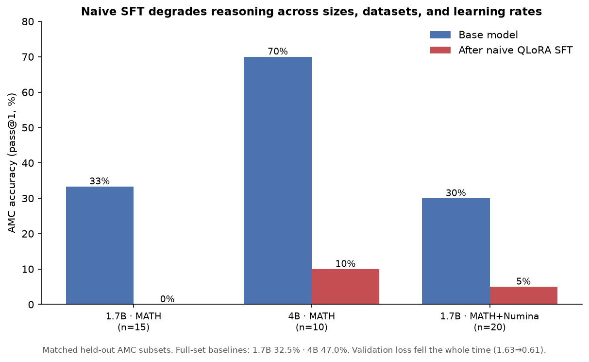

# AMC Tutor — what fine-tuning a small model for AMC 10/12 *actually* does

A reproducible, **$0**, contamination-controlled study of QLoRA fine-tuning small open
models (**Qwen3-1.7B** and **Qwen3-4B**) for AMC 10/12 competition math — run entirely
**locally on a MacBook Air M4 (16 GB)** with [MLX](https://github.com/ml-explore/mlx).

> **Headline (a negative result).** Naive supervised fine-tuning on open competition-math
> solutions **degrades** the reasoning of both base sizes on held-out AMC — *robustly across
> model size, dataset, and learning rate* — and standard **validation loss completely hides it**.
> The contribution is the rigorous, contamination-aware evaluation that *catches* this, the
> root-cause analysis, and the implications for how (not) to build small math tutors.

---

## Results



**Baselines (zero-shot, pass@1, full sets, 95% bootstrap CI):**

| Base model | AMC (83) | AIME (90) | base "no-answer" rate |
|---|---|---|---|
| Qwen3-1.7B-4bit | 32.5% [22.9, 43.4] | 6.7% [2.2, 12.2] | 36% AMC / 64% AIME |
| Qwen3-4B-4bit | **47.0%** [36.1, 57.8] | **11.1%** [5.6, 17.8] | 25% AMC / 49% AIME |

**Every fine-tuning variant regressed** (held-out AMC; FT measured on the same fixed subset
as its base column, since the verdict was unambiguous well before a full run was warranted):

| Fine-tune variant | base (same subset) | after SFT |
|---|---|---|
| 1.7B · MATH · LR 2e-4 · ckpt-200 | 5/15 | **0/15** |
| 4B · MATH · LR 2e-4 · ckpt-200 **and** ckpt-600 | 7/10 | **1/10** |
| 1.7B · MATH+NuminaMath · LR 1e-4 · ckpt-200 | 6/20 | **1/20** |

Two model sizes × two datasets × two learning rates × multiple checkpoints — **all regress.**

---

## The smoking gun (one held-out problem)

> *"m/n is the irreducible value of 3 + 1/(3 + 1/(3 + 1/3)); find m+n."* (gold **142**, = 109/33)

- **Base 4B** grinds through it step by step → 109/33 → **142** ✓
- **Fine-tuned 4B** confidently writes a *terse, slick, wrong* solution:
  `= 1/(1 + 1/3) = 3/4, so m+n = 7` ✗ (it dropped the leading 3 entirely)

The fine-tune learned MATH's **concise "clever-shortcut" style** and stopped doing the verbose,
self-correcting arithmetic that the base used to get it right. It even emits an empty
`<think></think>` and jumps straight to a confident wrong answer.

---

## Why standard practice would have missed it

Validation loss **fell monotonically the whole time** (1.63 → 0.61) while held-out accuracy
**collapsed**. Teacher-forced next-token loss on terse reference solutions rewards *imitating the
style*; it says nothing about whether free-generation reasoning stays correct. We only caught the
regression by **evaluating generated answers per-problem against the base on identical items** —
not by trusting the loss curve. That gap is the core methodological lesson.

This is the **base-strength × headroom tradeoff** (predicted in the project's Phase-1 plan): a
*stronger* base has little to gain and a lot of reasoning to *lose* from style-imitation SFT.

---

## Methodology (what makes the result credible)

- **Data.** Train = `EleutherAI/hendrycks_math` (genuine MATH train, 7.5k) filtered to **levels 3–5**
  (AMC difficulty); v2 adds `AI-MO/NuminaMath-CoT` (`synthetic_amc` 7,533 + `amc_aime` 443).
  Rendered to a tutor chat format ending in `\boxed{}`.
- **Decontamination.** Every train problem is checked against **all** eval problems (exact /
  shared-13-gram / 8-gram Jaccard ≥ 0.6). Removed **181 (3.2%)** from MATH; and notably **most of
  NuminaMath's `amc_aime`** — because it is 2022–24 AMC/AIME, which *overlaps the eval years*. (The
  decontamination is doing real work, not theater.)
- **Contamination-tiered eval.** Clean headline set `aimo-validation-amc` (83, AMC-12 2022–23,
  post-dates MATH) + `aimo-validation-aime` (90) + `MATH-500` (contaminated-tier reference).
- **Scoring.** pass@1, last `\boxed{}` compared via [`math_verify`](https://github.com/huggingface/Math-Verify)
  symbolic equivalence; **bootstrap 95% CIs** on every number (small sets → wide CIs, reported honestly).
- **The catch.** Per-problem base-vs-fine-tuned comparison on identical items (`scripts/diag_ft.py`).

## Engineering notes (local, $0, fanless)

- MLX QLoRA on the M4: 4B fits **6.2 GB** (with grad-checkpointing; OOMs without). ~35 tok/s (1.7B).
- The **fanless M4 thermal-throttles** under sustained load (0.21 → ~0.09 it/s); and **closing the
  lid sleeps the Mac, which hangs in-flight GPU jobs** (recover from the last checkpoint). Keep the
  lid open or `sudo pmset -a disablesleep 1`.

---

## What would actually work (and why we didn't here)

Naive SFT is the wrong tool for improving an already-decent small base on competition math. The
approaches that *do* work in the literature — and the honest next steps — are:

1. **Reasoning-distillation, not style-imitation.** Train on *verbose, correct* traces, e.g.
   **self-distillation (STaR):** sample the base's own solutions on training problems, **keep only
   the ones that reach the correct answer**, and fine-tune on those. Teaches the model its own
   *working* reasoning instead of terse human shortcuts. (Compute-heavy; needs a real GPU at scale.)
2. **RL with verifiable rewards (GRPO).** Optimize directly for answer-correctness. The DeepSeek-R1
   recipe; the principled way to *raise* reasoning rather than overwrite it.
3. **Base + good prompting / more decoding budget.** The 4B base already gets 47% and loses ~21
   problems purely to rambling past the token budget without boxing — recoverable *without* training.

For a strong small base on a hard reasoning task, **base + prompting ≥ naive SFT** — exactly the
day-one prediction.

---

## Reproduce

```bash
uv venv .venv --python 3.12
uv pip install --python .venv/bin/python datasets sympy math-verify pandas tqdm mlx mlx-lm
.venv/bin/python scripts/build_dataset.py            # MATH-only (add --numina for v2)
# baseline:
.venv/bin/python eval/evaluate.py --model mlx-community/Qwen3-4B-4bit \
    --data eval/amc.jsonl --name amc_base4b_zeroshot
# fine-tune (reproduces the regression):
.venv/bin/mlx_lm.lora -c configs/lora_qwen3_4b.yaml
.venv/bin/python eval/evaluate.py --model mlx-community/Qwen3-4B-4bit \
    --adapter adapters_4b --data eval/amc.jsonl --name amc_ft4b
.venv/bin/python scripts/diag_ft.py                  # per-problem base-vs-FT
```

## Limitations

Fine-tuned numbers are spot-checks (n=10–20 held-out items), not full 83-problem runs — the
collapse was unambiguous and consistent, so full runs weren't a good use of throttled compute.
Residual pretraining contamination is possible despite train/test decontamination (hence the
contaminated-vs-clean tiering). Results characterize a controlled local protocol, not SOTA.

## Attribution

Built with AI assistance (Claude Code). Datasets/base models used under their licenses
(MATH = MIT, NuminaMath & Qwen3 = Apache-2.0).
